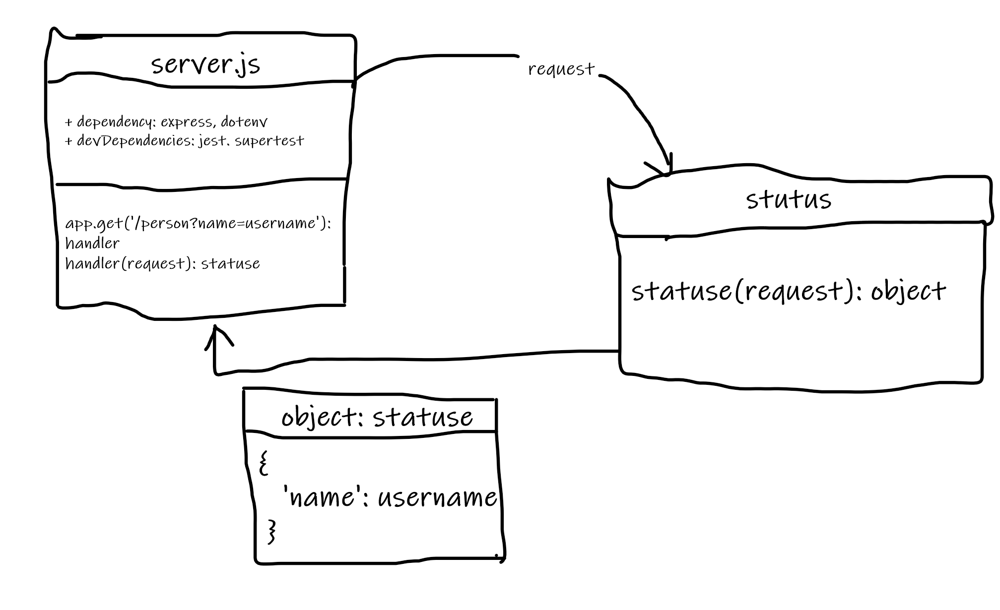

# basic-express-server

- description:

  - I did a simple express server that return objet of name and query for the name `{name: username}`, handle errors, and test all routs.

- features:

  - logger
  - get method and validation for the name
  - error test and handlers

- heroku link:

  - https://omars-basic-express-server.herokuapp.com/
  - https://omars-basic-express-server.herokuapp.com/person?name=username
  - https://omars-basic-express-server.herokuapp.com/person
  - https://omars-basic-express-server.herokuapp.com/err-dum

- test:

  - Unit Tests: `npm run test`
  - Lint Tests: `npm run dev`

- UML:
  
